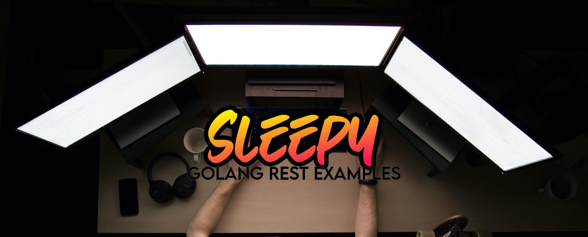

# Sleepy
Sleepy is a project to create a series of example structures for the creation of HTTP services with RESTful APIs.

These example template/structures will allow the easy design and deployment by following a chosen pattern and framework, each of which have their support networks, documentation (of various qualities) and examples around the internet. This project is an effort to create a central repository to house them all in one place.

## How?
Once you pull this in to your environment of choice, you can simply navigate to the framework of choice, head to the `cmd` folder and run Main.go

This will then work to pick up the port from the `.env` file, when you visit `localhost:<PORT>` it will respond with JSON or String value `Hello, World. - {FRAMEWORK NAME}`

## What frameworks?
Currently I have created two examples with others planned, each is linked where possible to their example github/website - Those already ticked have been completed.
 - [x] [Go Vanilla (HTTP package)](https://cs.opensource.google/go/go)
 - [x] [Gin-Gonic](https://github.com/gin-gonic/gin)
 - [x] [Echo by LabStack](https://github.com/labstack/echo)
 - [x] [Fiber](https://github.com/gofiber/fiber)

### To Do?
 - [ ] [Kratos](https://github.com/go-kratos/kratos)
 - [ ] [BeeGo (Aimed at Enterprise)](https://github.com/beego/beego)

## What Licence?
This project is released under MIT License.

Copyright (c) 2023 Jack Roden (jroden2 / jackjack-iot).

Permission is hereby granted, free of charge, to any person obtaining a copy
of this software and associated documentation files (the "Software"), to deal
in the Software without restriction, including without limitation the rights
to use, copy, modify, merge, publish, distribute, sublicense, and/or sell
copies of the Software, and to permit persons to whom the Software is
furnished to do so, subject to the following conditions:

The above copyright notice and this permission notice shall be included in all
copies or substantial portions of the Software.

THE SOFTWARE IS PROVIDED "AS IS", WITHOUT WARRANTY OF ANY KIND, EXPRESS OR
IMPLIED, INCLUDING BUT NOT LIMITED TO THE WARRANTIES OF MERCHANTABILITY,
FITNESS FOR A PARTICULAR PURPOSE AND NONINFRINGEMENT. IN NO EVENT SHALL THE
AUTHORS OR COPYRIGHT HOLDERS BE LIABLE FOR ANY CLAIM, DAMAGES OR OTHER
LIABILITY, WHETHER IN AN ACTION OF CONTRACT, TORT OR OTHERWISE, ARISING FROM,
OUT OF OR IN CONNECTION WITH THE SOFTWARE OR THE USE OR OTHER DEALINGS IN THE SOFTWARE.
